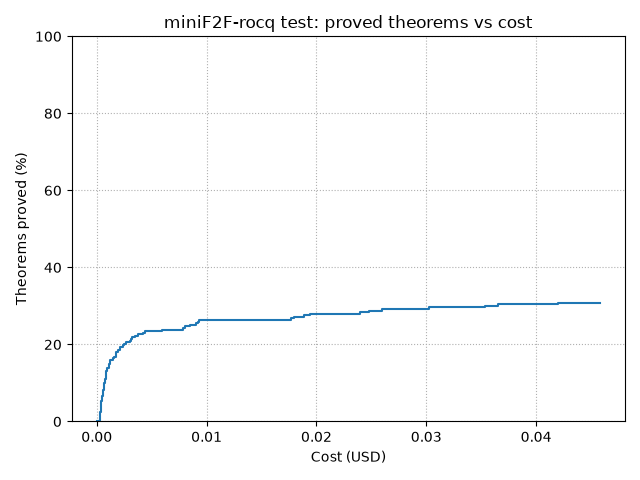

# LLMprover

Budget-aware proof search with LLMs and Rocq as the formal target language.

LLMprover does more than send a theorem to a language model once. It maintains
a graph of proof obligations, chooses where to spend the next attempt, asks
specialized agents for direct proofs, repairs, or helper-lemma decompositions,
and validates every candidate with `coqc`. Search stops when the root theorem
is proved or its dollar/attempt budget is exhausted.

## Results

The `positive_retry` campaign evaluated 243 of the 244 problems in the
miniF2F-rocq **test split**. The loader skipped `amc12_2001_p5` because its
`rocq_statement` field starts with malformed Markdown translation notes
instead of a valid Rocq theorem declaration. Each evaluated problem used a
pre-attempt budget threshold of **$0.04**:

| Metric | Result |
|---|---:|
| Problems evaluated | 243 |
| Theorems proved | **75 / 243 (30.9%)** |
| Estimated token cost (completed logs) | **$7.49** |
| Successful runs below $0.01 | **64 / 75** |
| Successful runs at or below $0.04 | **74 / 75** |

Among the 75 successful runs, the median search took **2 attempts**, and 55
finished within 5 attempts. Most final proofs use standard Rocq automation
such as `lia`, `lra`, `nra`, `ring`, or `compute`, sometimes after the model
has transformed the goal into a suitable form.



The generated [campaign report](results/minif2f/positive_retry/report.txt)
contains the aggregate cost buckets. Two complete logs illustrate the range
of successful searches:

- [`mathd_algebra_44`](results/minif2f/positive_retry/case_studies/mathd_algebra_44.log):
  a typical shallow success, closed in one attempt with `lra`;
- [`mathd_numbertheory_765`](results/minif2f/positive_retry/case_studies/mathd_numbertheory_765.log):
  a 27-attempt search that constructs and proves a coherent chain of three
  helper lemmas before assembling the final proof.

See the [case-study guide](results/minif2f/positive_retry/case_studies/README.md)
for a short explanation of both logs.

## How it works

Each iteration of the orchestrator performs one proof-search action:

1. A `LemmaSelectionStrategy` selects an open node in the proof-obligation
   graph.
2. An `AttemptStrategy` selects a prover agent and an LLM.
3. The agent proposes a direct proof, repairs a previous proof, or decomposes
   the goal into helper lemmas.
4. `CoqcBackend` assembles a complete Rocq fragment and checks it with `coqc`.
5. The attempt and its diagnostics are recorded, and the graph is updated.
6. When all dependencies of a successful decomposition are proved, the
   complete root proof is reconstructed and compiled again.

The campaign uses `PositiveRetryLemmaSelectionStrategy`. It schedules only
positive proof attempts, gives fresh helper obligations several opportunities,
then makes their parent competitive again so an unproductive decomposition
does not trap the search indefinitely.

### Prover agents

The available generation modes are:

- **direct**: produce a proof from the current goal;
- **repair**: use earlier scripts and Rocq diagnostics to try again;
- **decomposition**: introduce helper lemmas and a parent script that depends
  on them;
- **About variants**: query the available Rocq environment with `Search`,
  `SearchPattern`, and `About` before generating the proof.

A controller LLM chooses an agent and model from explicit registries. History
presenters give agents and the controller cache-friendly views of earlier
attempts.

The supplied selection prompt is tailored to `RepairDirectAboutAgent` and
`DecompositionAboutAgent`; changing the registered agent set currently also
requires adapting the selection prompt.

### Checked decomposition

Generated scripts are not accepted on model output alone. `CoqcBackend` runs
`coqc` and, for a successful decomposition, uses `Print Assumptions` to check
that the parent proof depends only on its declared helpers, names available in
the goal environment, or explicitly allowed axioms.

Helper references use placeholders such as `{helper}`. They are resolved to
the corresponding child-node names when scripts are checked and when the final
proof is assembled. Convertibility checks can merge equivalent helpers with
existing nodes, turning the initial search tree into a DAG.

This assumption check is a consistency mechanism, not a security boundary: it
was not designed to validate adversarial Rocq input.

## Quick start

Prerequisites:

- Python 3.11 or newer;
- Rocq with `coqc` available on `PATH`;
- an OpenAI API key for the supplied demo and evaluation configuration.

Install the project and run the tests:

```bash
pip install -e ".[dev,bench]"
python3 -m pytest
```

Create a `.env` file at the repository root:

```bash
OPENAI_API_KEY=your-key-here
```

Then run the small demo or a three-problem evaluation:

```bash
python main.py
python eval_minif2f.py --lemma-selector positive-retry --limit 3
```

`eval_minif2f.py` writes one resumable log per problem under
`benchmark_runs/<selector>/`. This directory is gitignored. Both commands above make paid OpenAI API calls.
The second evaluates only three problems. Omitting `--limit` runs the full test split and can incur
several dollars:

```bash
python eval_minif2f.py --lemma-selector positive-retry
```

The LLM client layer also supports Mistral and Anthropic:

| Provider | Environment variable |
|---|---|
| OpenAI | `OPENAI_API_KEY` |
| Mistral | `MISTRAL_API_KEY` |
| Anthropic | `ANTHROPIC_API_KEY` |

Shell environment variables take precedence over values loaded from `.env`.

## Repository structure

| Area | Responsibility |
|---|---|
| `llmprover/domain.py` | Goals, proof attempts, graph nodes, positions, polarities, and statuses |
| `llmprover/orchestrator.py` | Budgeted proof-search loop and final proof reconstruction |
| `llmprover/strategy/` | Goal scheduling and agent/model selection |
| `llmprover/prover_agents/` | Direct, repair, decomposition, and library-aware proof generation |
| `llmprover/rocq/` | Script construction, `coqc` execution, diagnostics, helper resolution, and equivalence checks |
| `llmprover/history/` | Prompt-facing representations of previous attempts |
| `llmprover/llm/` | Provider clients, prompt messages, model registry, token usage, and pricing |
| `llmprover/minif2f/` | Conversion of miniF2F-rocq rows into project goals |
| `eval_minif2f.py` | Live evaluation, resumable logs, reports, and cost plots |
| `results/` | Versioned aggregate results and selected full logs |

## Limitations

- **Whole-script feedback is expensive.** Invalid tactic names, incomplete
  scripts, and brittle library queries are recurring failure modes in the
  campaign logs. Interactive Rocq sessions could reject bad steps earlier.
- **Mathematical exploration and formalization are coupled.** The same agent
  must find an idea and express it in valid Rocq. A separate mathematical-plan
  stage could let this system specialize in checked formalization.
- **Search control remains heuristic.** `positive_retry` prevents the search
  from remaining indefinitely below one decomposition, but it is not a learned
  or globally optimized scheduler.
- **Results are configuration-specific.** The reported campaign covers one
  dataset, model configuration, and random run. It is a reproducible snapshot
  of the current orchestration method, not a comparison of foundation models
  or a general theorem-proving benchmark claim.

## Roadmap

- [ ] Interactive, step-by-step Rocq feedback through Pytanque
- [ ] Separate mathematical planning from Rocq formalization
- [ ] Treat lemma scheduling as graph optimization / metareasoning under a
      resource budget
- [ ] Improve Rocq library discovery through better query selection and result ranking

## License

This project is released under the [MIT License](LICENSE).
